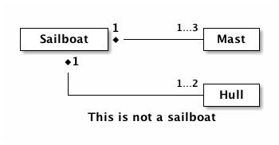

# Ditaa

When a drop of water joins the ocean it becomes the ocean.

# Graphviz

# PlantUML

**Sequence Diagram**

-   Feature rich.
-   Information rich.

**Use Case Diagram**

-   Actor variable aliasing feature.

**Class Diagram**

-   Valuable for all sorts of ideas in addition to classes.
-   `hide`, `show`, and `include` are mentioned.
    -   Could be a great reuse mechanism combined with noweb and tangling.
-   Spotted characters might be useful to indicating other things.
    -   Example is data which is clearly a first-class citizen.
    -   Six package visualization types.
    -   Packaging vs. namespaceing.
    -   Good support for splitting large images among output pages.

**Activity Diagram**

-   May indicate top to bottom flow using `top`.
-   May label arrows.
-   May force arrow direction.
-   if/else structure for branching.
-   Partition construct.
-   [New syntax](http://plantuml.sourceforge.net/activity2.html) with more examples.

**Component Diagram**

-   The names to define all of the diagram entity types.
-   Identify &ldquo;Modern UML&rdquo;.
-   Good for summaries.

**State Diagram**

**Object Diagram**

-   Commands.
    -   Header and footer values.
    -   Zoom level.
    -   Creole markup for most text elements.
    -   Lists and sub-lists.
    -   Horizontal lines. Will appear in most containers.
    -   Headings.
    -   Plain old HTML.
    -   Tables, LaTeX style.
    -   Use [OpenIconic icons](https://useiconic.com/open) anywhere.

-   Fonts and colors.
    -   You can change just about everything.
    -   You may nest definitions.
    -   `monochrome true` option.
        -   If you are printing
        -   Or don&rsquo;t want color.

-   Internationalization.
    -   Full Unicode character support.
